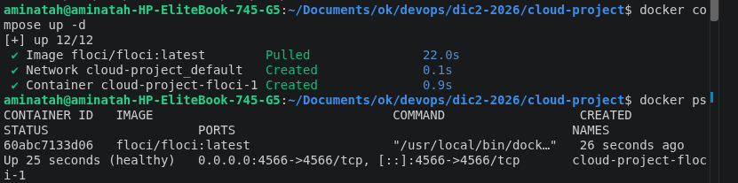
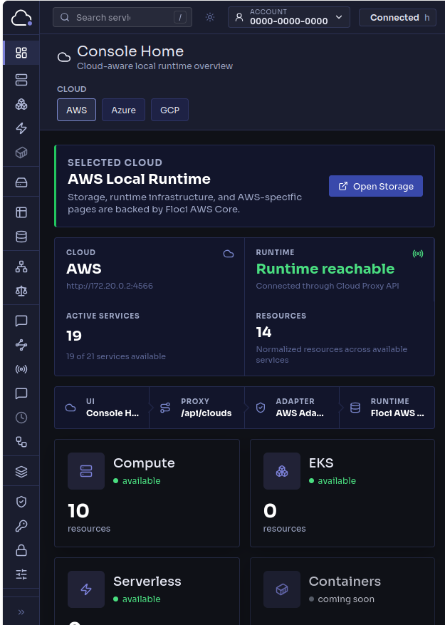
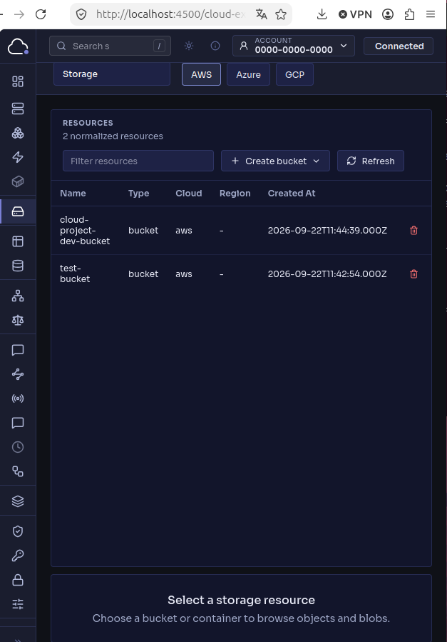
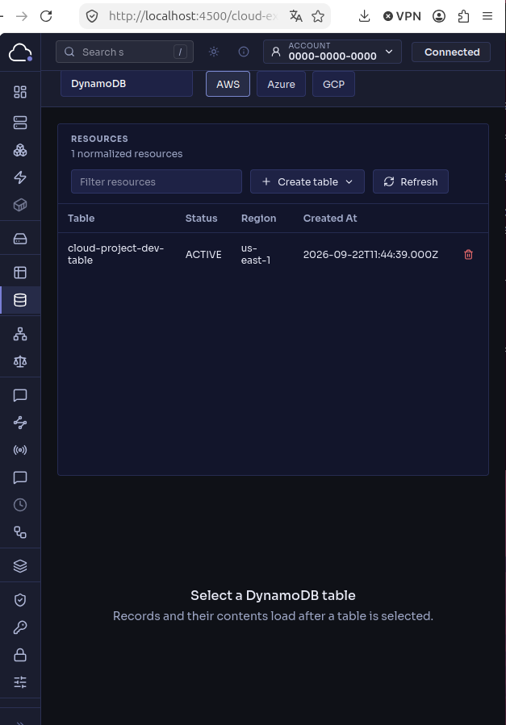
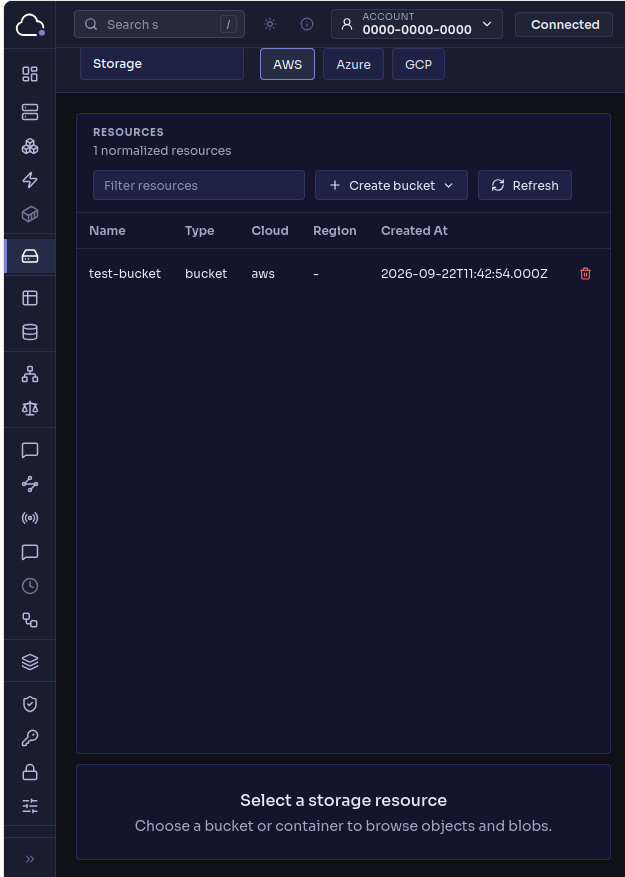
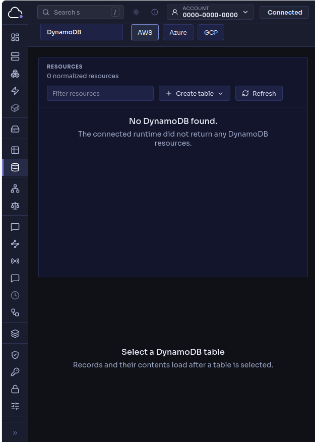

# Projet Cloud — Floci et Terraform

Déploiement de deux services AWS (S3 et DynamoDB) dans un Cloud local simulé par **Floci**, avec **Terraform**.

## 1. Provider et services

- **Provider :** AWS
- **Service 1 :** S3 (stockage d'objets), module `modules/storage`
- **Service 2 :** DynamoDB (base de données NoSQL), module `modules/database`

**Pourquoi ces choix ?** Ce sont deux types de services très différents (stockage et base de données), très utilisés et bien documentés avec Terraform. Floci les supporte directement.

## 2. Prérequis

- Docker et Docker Compose
- Terraform 1.6 ou plus
- AWS CLI (facultatif)

## 3. Lancer Floci

L'image Docker est téléchargée automatiquement au premier lancement.

```bash
docker compose up -d
```

Floci écoute sur le port **4566**. Pour vérifier qu'il fonctionne :

```bash
export AWS_ACCESS_KEY_ID=test
export AWS_SECRET_ACCESS_KEY=test
export AWS_DEFAULT_REGION=us-east-1
aws --endpoint-url http://localhost:4566 s3 ls
```



## 4. Lancer Floci UI

Ouvrir `http://localhost:4566/_floci/ui` (redirige vers `http://localhost:4500`), puis choisir **AWS**. On y trouve les services **Storage (S3)** et **DynamoDB** utilisés dans ce projet.



## 5. Configurer Terraform

| Fichier | Rôle |
|---|---|
| `providers.tf` | Provider AWS qui pointe vers Floci (`http://localhost:4566`) avec des clés factices |
| `variables.tf` | Variables du projet |
| `terraform.tfvars` | Valeurs des variables (environnement `dev`) |
| `locals.tf` | Préfixe des noms : `<projet>-<environnement>` |
| `main.tf` | Appelle les deux modules |
| `outputs.tf` | Affiche les noms et ARN des ressources |

Ressources créées : le bucket `cloud-project-dev-bucket` et la table `cloud-project-dev-table`.

**Terraform avec Floci ou avec le vrai AWS ?** Le code des ressources est le même. Avec Floci, le provider envoie les requêtes à un endpoint local (`localhost:4566`) avec de fausses clés, donc rien n'est facturé et rien ne sort de la machine. Avec le vrai AWS, on retire l'endpoint local et on utilise de vraies clés.

## 6. Déployer

```bash
terraform init       # télécharge le provider
terraform fmt        # formate le code
terraform validate   # vérifie le code
terraform plan       # prévisualise (2 ressources à créer)
terraform apply      # crée les ressources
```

## 7. Vérifier dans Floci UI

Sur `http://localhost:4500` :
- page **Storage** : le bucket `cloud-project-dev-bucket` apparaît ;
- page **DynamoDB** : la table `cloud-project-dev-table` apparaît.

| S3 | DynamoDB |
|---|---|
|  |  |

## 8. Détruire

```bash
terraform destroy
```

Les deux ressources disparaissent de Floci UI.

| S3 | DynamoDB |
|---|---|
|  |  |

Pour arrêter Floci : `docker compose down`.

## Bonus

- **Validation des variables** dans `variables.tf`.
- **Environnements dev et prod** dans `envs/`. Chaque environnement a son propre workspace :
  ```bash
  terraform workspace new prod
  terraform apply -var-file=envs/prod.tfvars
  ```
- **Tests Terraform** : `terraform test`.
- **Documentation des modules** avec terraform-docs, dans `modules/*/README.md`.